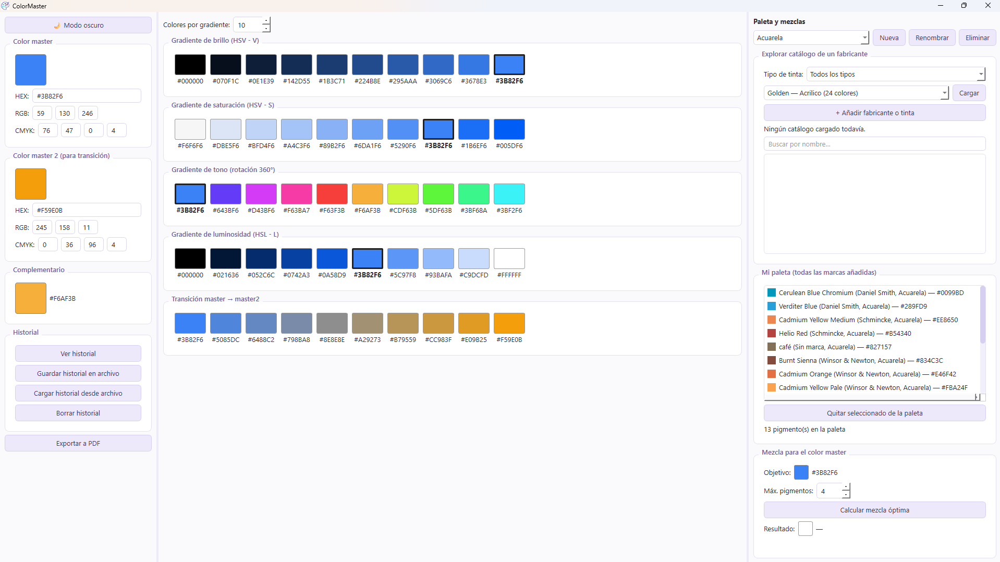

# 🎨 ColorMaster

Aplicación de escritorio (PySide6) para artistas que trabajan con acuarela, acrílico y óleo: elige un color, genera sus gradientes de brillo/saturación/tono/luminosidad, gestiona tu paleta real de pigmentos, y descubre qué proporción de tus tintas necesitas mezclar para conseguir un color objetivo.


-green)


---

## 📑 Índice

- [Funcionalidad](#-funcionalidad)
- [Capturas](#-capturas)
- [Arquitectura en breve](#-arquitectura-en-breve)
- [Instalación](#-instalación)
- [Uso](#-uso)
- [Estructura del proyecto](#-estructura-del-proyecto)
- [Cómo añadir tus propias tintas a la base de datos](#-como-anadir-tus-propias-tintas-a-la-base-de-datos)
- [Cómo ampliar la base de datos oficial con un fabricante nuevo](#-como-ampliar-la-base-de-datos-oficial-con-un-fabricante-nuevo)
- [Fuentes de datos y licencias](#-fuentes-de-datos-y-licencias)
- [Licencia](#-licencia)

## ✨ Funcionalidad

- **Selector de color** tipo Photoshop (hex, RGB, CMYK), con color complementario automático.
- **5 gradientes de 10-27 pasos** (configurable): brillo, saturación, tono, luminosidad, y una transición libre entre dos colores.
- **Explorador de catálogos de fabricantes**: carga perezosa (solo se lee el Excel del fabricante que decides explorar, nunca todos a la vez) con filtro por tipo de tinta y buscador por nombre.
- **Paleta personal**: guarda qué pigmentos tienes, de cualquier fabricante, en SQLite. Puedes tener varias paletas con nombre.
- **Sugerencia de mezcla óptima**: dado un color objetivo y tu paleta, calcula qué proporción de hasta 4 de tus pigmentos se aproxima más, con el ΔE (diferencia de color) del resultado.
- **Añadir tus propios pigmentos**: un fabricante nuevo, o una tinta más de un fabricante ya existente, con color introducido a mano (hex directo o valores L\*a\*b\*).
- **Historial** de colores seleccionados y mezclas calculadas, exportable/importable a un archivo.
- **Exportación a PDF** de un informe completo (color master, gradientes, paleta, mezcla, historial reciente).
- Interfaz en español, con tema claro/oscuro.

## 📸 Capturas

> 
> Captura de pantalla de ColorMaster

## 🧩 Arquitectura en breve

- **`core/color_math.py`**: todas las conversiones de color (HEX/RGB/HSV/HSL/CMYK/Lab) y la generación de gradientes. Sin dependencias de Qt.
- **`core/mixer.py`**: modelo de mezcla de pigmentos. Como no se dispone de reflectancia espectral real de los pigmentos, se usa una aproximación de Kubelka-Munk de constante única aplicada a cada canal RGB (más realista que promediar RGB directamente), ponderada por la opacidad de cada pigmento.
- **`database/db_manager.py`**: paletas de usuario en SQLite. Cada pigmento guardado en una paleta lleva copiados sus propios datos (nombre, marca, tipo, hex, opacidad) — así mostrar la paleta o calcular una mezcla nunca necesita releer ningún Excel de fabricante, por grande que llegue a ser la base de datos de catálogos.
- **`database/pigment_index.xlsx`**: índice ligero (una fila por combinación marca+tipo) que se carga siempre al arrancar. El Excel real de un fabricante solo se carga cuando el usuario decide explorarlo.

## 🚀 Instalación

Requiere Python 3.10+ y Windows, macOS o Linux con soporte para PySide6.

```bash
git clone [<url-del-repositorio>](https://github.com/Zontro01/Color_Master.git)
cd Color_Master
pip install -r requirements.txt
```

## 📸 Uso

```bash
python main.py
```

## 🗂️ Estructura del proyecto

```
ColorMaster/
├── main.py                  # punto de entrada
├── ui/                       # interfaz PySide6
├── core/                     # lógica de color y mezclas (sin Qt)
├── database/                 # índice de catálogos + gestor SQLite de paletas del usuario
├── utils/                    # conversor Lab->hex, historial, exportación a PDF
├── resources/                # temas claro/oscuro (.qss)
└── data_sources/             # CSV originales usados para construir los catálogos oficiales
```

Para el detalle completo de cada archivo, ver [`FILES.md`](FILES.md).

## 🖌️ Cómo añadir tus propias tintas a la base de datos

Desde la propia aplicación, sin tocar ningún archivo a mano:

1. Abre el panel derecho, sección **"Explorar catálogo de un fabricante"**.
2. Pulsa **"+ Añadir fabricante o tinta"**.
3. En **Marca**, elige "Fabricante existente" (si es una tinta más de una marca que ya está en tu base de datos) o "Fabricante nuevo" (si es una marca que no tienes todavía).
4. Igual para **Tipo de tinta** (Acrílico / Acuarela / Óleo, o uno nuevo).
5. Escribe el **nombre** del color.
6. Elige cómo dar el color:
   - **"Elegir color directamente"**: si solo quieres aproximarlo a ojo o tienes su código hex.
   - **"Introducir valores L\*a\*b\***"**: si tienes una ficha técnica con esos valores (más preciso). Ver más abajo cómo conseguirlos de una fuente real.
7. Ajusta **opacidad** (0 = transparente, 1 = opaco) y **fiabilidad** (1-5, cuánto te fías tú mismo de este dato).
8. Guarda. La tinta queda disponible al instante para añadirla a tu paleta.

### De dónde sacar valores L\*a\*b\* reales

La web **[artistpigments.org](https://artistpigments.org)** tiene mediciones CIE L\*a\*b\* reales de miles de colores de cientos de marcas, hechas con espectrofotómetro. Es la fuente recomendada para tintas puntuales que tú mismo uses:

1. Crea una cuenta gratuita en artistpigments.org (los valores numéricos completos están bloqueados sin cuenta).
2. Busca tu marca y el color exacto (por nombre o número).
3. Anota los valores **L\***, **a\***, **b\*** de la ficha del color, y su categoría de **transparencia** (Opaque / Semi-Opaque / Semi-Transparent / Transparent).
4. En ColorMaster, usa el modo "Introducir valores L\*a\*b\*" del diálogo de añadir pigmento con esos 3 números.
5. Para la opacidad, una equivalencia razonable:

   | Transparencia (artistpigments.org) | Opacidad en ColorMaster |
   |---|---|
   | Opaque | 0.90 |
   | Semi-Opaque | 0.65 |
   | Semi-Transparent | 0.40 |
   | Transparent | 0.15 |

6. En **fuente**, escribe algo como `artistpigments.org (cuenta propia) - [nombre de la marca en su web]`, y pon la **fiabilidad** en 4 (dato medido por un tercero con metodología publicada, no el propio fabricante).

⚠️ **Importante — licencia**: el contenido de artistpigments.org está bajo licencia **[CC BY-NC 4.0](https://creativecommons.org/licenses/by-nc/4.0/)** (uso no comercial, con atribución). Esto es perfectamente correcto para tu propia paleta personal, pero significa que **no se debe redistribuir un volcado masivo de sus datos** como parte de la base de datos oficial de este repositorio. Por eso ColorMaster no incluye ningún catálogo extraído de artistpigments.org — solo lo que cada usuario añade a su propia base de datos local.

## 🏭 Cómo ampliar la base de datos oficial con un fabricante nuevo

Esto es para quien mantiene el repositorio, no para el uso normal de la app (que ya cubre el apartado anterior). Requiere encontrar una fuente **oficial, pública y gratuita** con valores numéricos de color (no cartas de color en PDF sin datos, no fuentes con login) para poder incluirla como catálogo con fiabilidad alta. Ver [`FILES.md`](FILES.md) para el criterio completo y el historial de qué fabricantes se investigaron.

```bash
# 1. Convertir un CSV con columnas Nombre,Tipo,L,a,b,Opacidad
python utils/conversor_lab_hex.py --input data_sources/mi_fabricante.csv \
    --output database/mi_fabricante_convertido.xlsx \
    --fuente "Mi Fabricante Official" --marca "Mi Fabricante" --fiabilidad 5

# 2. Añadir una entrada en database/build_index.py (lista SOURCES)

# 3. Regenerar el índice
python database/build_index.py
```

## 📚 Fuentes de datos y licencias

- **Daniel Smith Acuarela** (214 colores, incluido en este repositorio): datos oficiales publicados por el propio fabricante en [danielsmith.com](https://danielsmith.com) (tabla pública de coordenadas CIE Lab + ficha de transparencia). Se citan como cortesía; la marca y los datos son propiedad de Daniel Smith Corporation.
- Cualquier dato que añadas tú mismo desde artistpigments.org u otra fuente queda en **tu base de datos local** (SQLite, no se sube a este repositorio) y conserva los términos de esa fuente — ver la sección anterior.

## ⚖️ Licencia

El código de este repositorio se distribuye bajo licencia **MIT** — ver [`LICENSE`](LICENSE). Esto cubre el software, no los datos de color de terceros que puedas añadir a tu base de datos personal.
